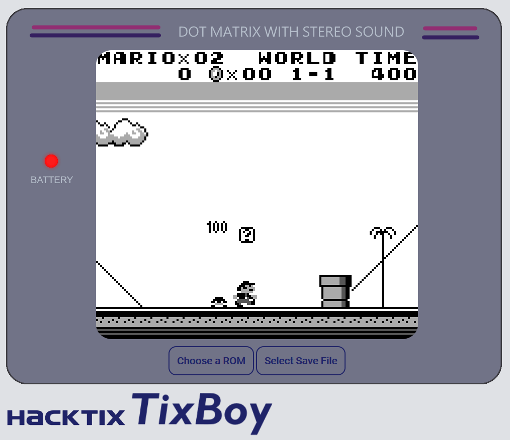
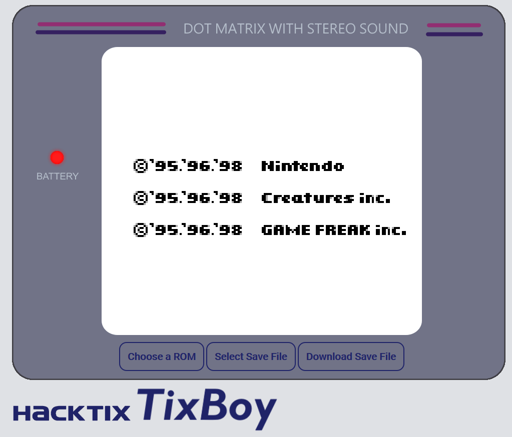
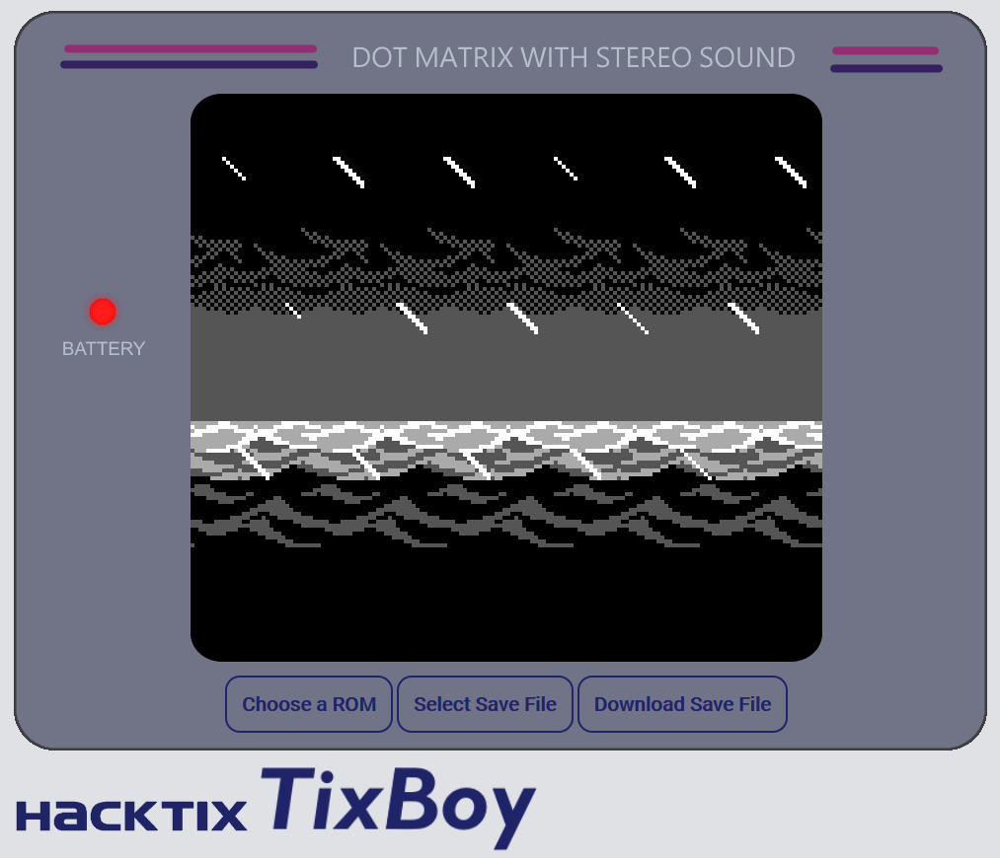

# TixBoy

## What's this?

TixBoy is (a very original idea and) a browser-based Gameboy Emulator written in JavaScript using no additional libraries or frameworks.

## Features

* Full DMG Support
* (Planned) Gameboy Color Support
* Audio Output (Channels 1 & 2, planned support for 3 & 4)
* Above-average Graphics Emulation Accuracy (with a fully featured Pixel FIFO implementation)
* Emulator Core passing all of Blargg's CPU Instructions and Timing tests as well as most (but not all) Mooneye Tests
* Save File System (with planned Local Storage usage in order to abandon actual File Downloads)
* Support for many Memory Bank Controllers (MBC1, MBC2, MBC3, MBC5) with an accurate Real Time Clock implementation

## Screenshots

